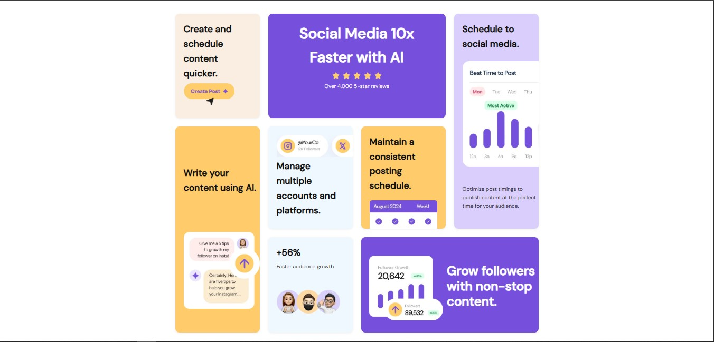

# Frontend Mentor - Bento Grid Solution

This is a solution to the [Bento Grid Challenge on Frontend Mentor](https://www.frontendmentor.io/challenges/bento-grid-RMydElrlOj). Frontend Mentor challenges help you improve your coding skills by building realistic projects. 

## Table of contents

- [Overview](#overview)
  - [The challenge](#the-challenge)
  - [Screenshot](#screenshot)
  - [Links](#links)
- [My process](#my-process)
  - [Built with](#built-with)
  - [What I learned](#what-i-learned)
  - [Continued development](#continued-development)
- [Author](#author)

## Overview

### The challenge

Users should be able to:

- View the optimal layout for the interface depending on their device's screen size.

### Screenshot

### Links

- Solution URL: [https://github.com/ziryazy/bento-grid-layout](https://github.com/ziryazy/bento-grid-layout)
- Live Site URL: [https://yazy-bento.vercel.app/](https://yazy-bento.vercel.app/)

## My process

### Built with

- Semantic HTML5
- CSS3
- CSS Grid
- Mobile-first workflow
- Visual Studio Code

### What I learned

During this challenge, I practiced:

- CSS Grid layouts with responsive design.
- Using `grid-area` and `media queries` to reposition elements based on screen size.
- Maintaining a clean and modular CSS structure.

### Continued development

In future projects, I want to improve on:

- Animation and interaction (hover effects, transitions).
- Accessibility (ARIA roles, screen reader-friendly markup).
- Better use of utility classes and CSS variables.

## Author

- GitHub - [@ziryazy](https://github.com/ziryazy)
- Frontend Mentor - [@ziryazy](https://www.frontendmentor.io/profile/ziryazy)

